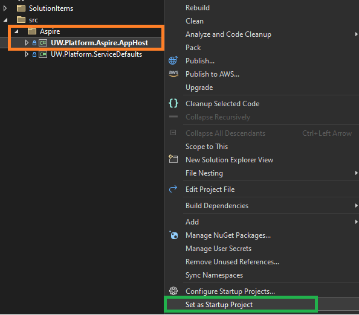
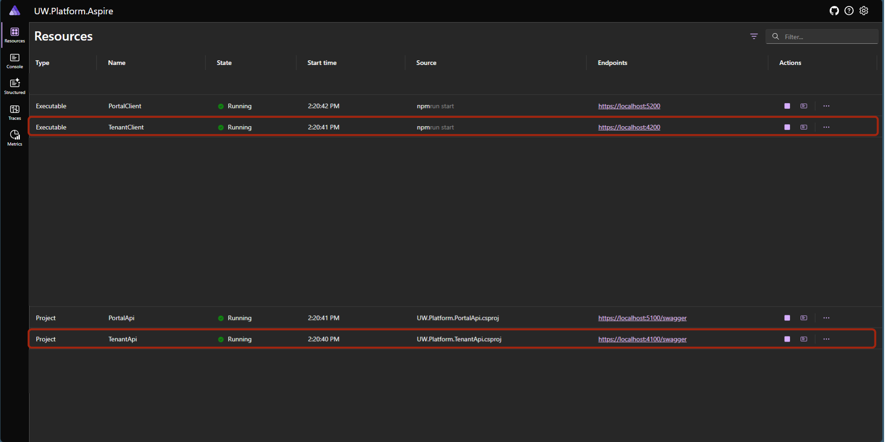
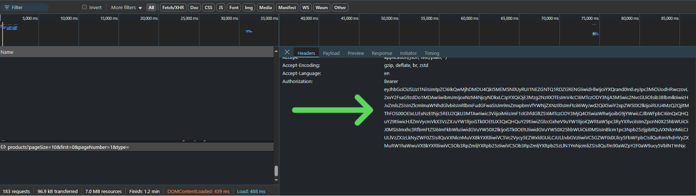
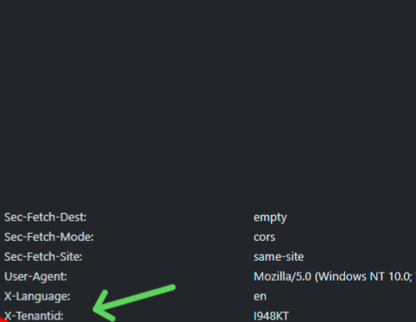
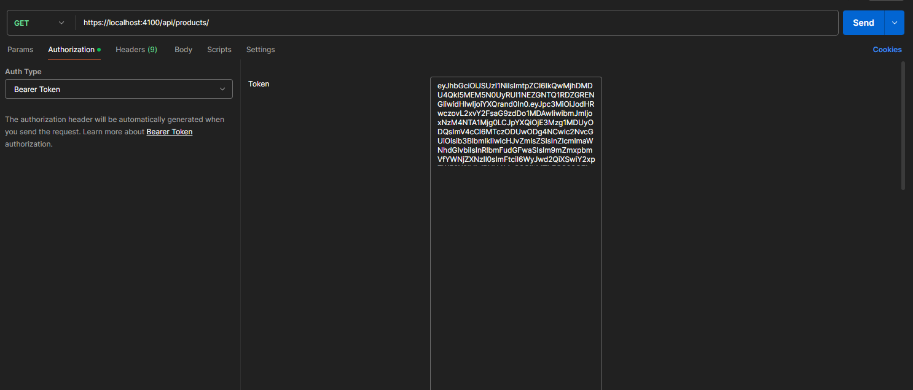
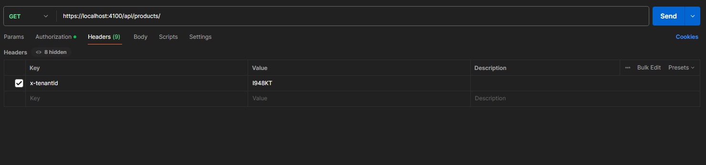
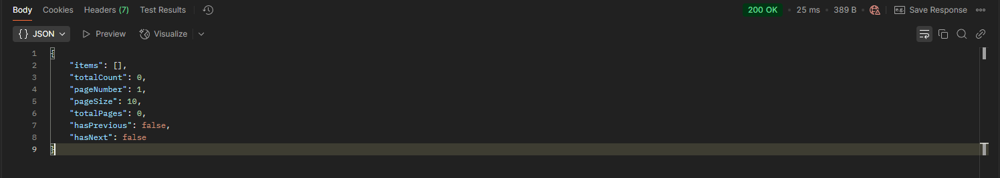

# 1 - Server-Side
import BrowserWindow from '@site/src/components/BrowserWindow';

## Introduction

Welcome to the Server-Side Development Guide for our platform! 

This guide will walk you through building a complete module in our system using the Book Store example. Whether you're new to our stack or just need a refresher, we've got you covered!

You'll learn how to:

- ✅ Set up the module structure
- ✅ Implement CRUD operations (Create, Read, Update, Delete)
- ✅ Apply proper validations to ensure data integrity
- ✅ Support multi-tenancy so the system can handle multiple organizations smoothly
- ✅ Follow best practices for maintainable and scalable code

By the end of this guide, you'll have a fully functional module and a solid understanding of how server-side development works in our platform. 

:::tip Advice
Start with Architecture part of the [Architecture Guide](/docs/architecture.md) to get a better understanding of the platform's architecture.
:::

## Prerequisites
:::note
Before starting module development, ensure you have:
- Access to the UW Platform solution
- SQL Server installed
- Entity Framework Core tools
- Required development environment setup
:::
## Creating the Book Module

### Entity Creation

1. Create the Book entity in the Domain layer (`UW.Platform.Domain.Entities`):

<BrowserWindow title="" url="https:localhost:4100" language="csharp">
```csharp
public class Book : AuditableEntityBase, IMultiTenantEntity
{
    [MaxLength(StringLength.L50)]
    [Column(Order = 1)]
    public string Name { get; set; } = null!;
    [Column(Order = 2)]
    public BookTypeEnum Type { get; set; }
    [Column(Order = 3)]
    public DateTime PublishDate { get; set; }
    [Column(Order = 4)]
    public decimal Price { get; set; }
    [Column(Order = 5)]
    public int? TenantId { get; set; }
    public Tenant? Tenant { get; set; }
}
```
</BrowserWindow>

:::warning
The `[Column(Order = Number)]` property is used to define the order of columns in the database table.
:::
2. Create the BookTypeEnum in `UW.Platform.Domain.Enums`:

<BrowserWindow title="" url="https:localhost:4100" language="csharp">
```csharp
public enum BookTypeEnum
{
    [Description("Undefined")]
    Undefined,
    [Description("Adventure")]
    Adventure,
    [Description("Biography")]
    Biography,
    // ... other types
}
```
</BrowserWindow>

### Database Configuration

1. Add Book entity to `IAppDbContext`:

<BrowserWindow title="" url="https:localhost:4100" language="csharp">
```csharp
public interface IAppDbContext
{
    public DbSet<Book> Books { get; set; }
    // ... other entities
}
```
</BrowserWindow>
2. Add configuration to `AppDbContext`:
<BrowserWindow title="" url="https:localhost:4100" language="csharp">
```csharp
    public virtual DbSet<Book> Books { get; set; }
```
</BrowserWindow>
3. Add entity configuration in `EntityConfigurations` (optional):

<BrowserWindow title="" url="https:localhost:4100" language="csharp">
```csharp
public class BookConfiguration : IEntityTypeConfiguration<Book>
{
    public void Configure(EntityTypeBuilder<Book> builder)
    {
        builder.HasIndex(x => x.Name)
            .IsUnique(false);
    }
}
```
</BrowserWindow>


4. Open Terminal and Create and apply migration:
<BrowserWindow title="" url="in terminal" language="bash">
```bash
dotnet ef migrations add Create_Book_Entity --context AppDbContext --project src\UW.Platform.Migrator --startup-project src\UW.Platform.Migrator --output-dir Data\AppDb
```
</BrowserWindow>
:::tip
You can check Batches in ``` etc/batches/Run-Migrations.bat``` to  run migrations automatically or run the next command.
:::
5. Update database:

<BrowserWindow title="" url="in terminal" language="bash">
```bash
dotnet ef database update --context AppDbContext --project src\UW.Platform.Migrator --startup-project src\UW.Platform.Migrator
```
</BrowserWindow>


### Permission Setup Guide

This guide outlines the steps required to set up new permissions for your project.

#### 1. Add permissions to `TenantPermissions.cs`

<BrowserWindow title="" url="https:localhost:4100" language="csharp">
```csharp
public static class TenantPermissions
{
    public static class Books
    {
        public const string Default = $"{GroupName}.Books";

        public const string Add = $"{Default}.Create";

        public const string Update = $"{Default}.Update";

        public const string Delete = $"{Default}.Delete";
    }
}
```
</BrowserWindow>

#### 2. Update JSON Files for Seeding

The seeder depends on JSON files. To add new permissions, you need to update the following JSON files in the `UW.Platform.Migrator.Seeders.AppDb.InitialData` directory:

#### Important Notes:
- For any JSON file you modify, change its "Copy to Output Directory" property to "Copy always" in the Properties Window (Alt + Enter)
- After modifying JSON files, rebuild the migrator project
- Run the batch file in `etc/batches/Run-Migrations.bat` to apply the seeding data
- **Don't forget commas** between JSON objects - missing commas will result in empty tables

##### a. Update `PermissionGroups.json`

Add a new permission group:
<BrowserWindow title="" url="https:localhost:4100"  language="json">
```json
{
  "Id": 44,
  "Name": "Book Management",
  "PermissionType": 2
}
```
</BrowserWindow>

**Note:** PermissionType values:
- 1 = Host 
- 2 = Tenant

##### b. Update `Permissions.json`

Add new permissions:
<BrowserWindow title="" url="https:localhost:4100"  language="json">

```json
{
  "Id": 3351,
  "Key": "T.Books",
  "Name": "Read Books list and details",
  "PermissionType": "Tenant",
  "PermissionGroupId": 44
},
{
  "Id": 3352,
  "Key": "T.Books.Add",
  "Name": "Add Books",
  "PermissionType": "Tenant",
  "PermissionGroupId": 44
},
{
  "Id": 3353,
  "Key": "T.Books.Update",
  "Name": "Update Books",
  "PermissionType": "Tenant",
  "PermissionGroupId": 44
},
{
  "Id": 3354,
  "Key": "T.Books.Delete",
  "Name": "Delete Books",
  "PermissionType": "Tenant",
  "PermissionGroupId": 44
}
```
</BrowserWindow>
###
:::tip 
The `CustomIdentity` attribute is used to assign a unique identifier to each permission. Host permissions are assigned `1000` and tenant permissions are assigned `2000` and above.
:::
:::warning 
Increment The `CustomIdentity` by 100 for each new permission.
:::

##### c. Update `Roles.json`

Add a new role:
<BrowserWindow title="" url="https:localhost:4100"  language="json">

```json
{
  "Id": 21,
  "Name": "books app",
  "NormalizedName": "BOOKS APP",
  "DisplayName": "Books Application",
  "Description": "Books Application",
  "RoleType": "Tenant"
}
```
</BrowserWindow>

##### d. Update `RolePermissions.json`

Map the new role to its permissions:
<BrowserWindow title="" url="https:localhost:4100"  language="json">

```json
{
  "Id": 144,
  "RoleId": 21,
  "PermissionId": 3351
},
{
  "Id": 145,
  "RoleId": 21,
  "PermissionId": 3352
},
{
  "Id": 146,
  "RoleId": 21,
  "PermissionId": 3353
},
{
  "Id": 147,
  "RoleId": 21,
  "PermissionId": 3354
}
```
</BrowserWindow>

#### 3. Apply Changes

After updating all JSON files:
1. Make sure all modified JSON files have "Copy to Output Directory" set to "Copy always"
2. Rebuild the migrator project
3. Run `etc/batches/Run-Migrations.bat` to apply the seeding data
4. After seeding is complete, remember to return the 'Copy to Output Directory' property back to its original setting in all JSON files

## Adding Feature to System

1. Update `AppFeatures.cs`:
:::note
We have integrated this module into the system's feature list, allowing it to be treated as an optional feature. This enables tenants to `subscribe` to the module if they wish to include it in their platform.

:::warning
`[CustomIdentity((int)FeatureEnum.Books)]` is used to assign a unique identifier to each feature by the number that we have assigned to the enum feature next.
:::

<BrowserWindow title="" url="https:localhost:4100" language="csharp">
```csharp
public static class AppFeatures
{
    [CustomIdentity((int)FeatureEnum.Books)]
    [CustomDisplayName("Books Feature")]
    [Description("Books Feature")]
    [FeatureLimits(LimitTypeEnum.NoLimits, 0, "")]
    public const string Books = "Books";
}
```
</BrowserWindow>

:::danger 
Make sure to add the new feature to the `FeatureEnum` enum and assign a unique identifier to it to avoid conflicts with existing features.
:::
2. Update enum in `FeatureEnum`
<BrowserWindow title="" url="https:localhost:4100" language="csharp">
```csharp
public enum FeatureEnum
{
    Sms = 1,
    Contacts = 2,
    Whatsapp = 3,
    ....
    Books = 4, // Added for Books with unique id `4`
}
```
</BrowserWindow>


### Update JSON Files for Feature Seeding

Similar to the permissions setup, you need to update the JSON files for features. These files are also located in the `UW.Platform.Migrator.Seeders.AppDb.InitialData` directory:

#### Important Notes:
- For any JSON file you modify, change its "Copy to Output Directory" property to "Copy always" in the Properties Window (Alt + Enter)
- After modifying JSON files, rebuild the migrator project
- Run the batch file in `etc/batches/Run-Migrations.bat` to apply the seeding data
- **Don't forget commas** between JSON objects - missing commas will result in empty tables

##### a. Update `Features.json`

Add the new feature:
<BrowserWindow title="" url="https:localhost:4100"  language="json">
```json
{
  "Id": 25,
  "Key": "Books",
  "Name": "Books Feature",
  "Description": "Books Feature",
  "LimitType": 1,
  "MaxPlanLimitValue": 0,
  "LimitUnit": "",
  "IsActive": true,
  "FeatureGroupId": null,
  "SortOrder": 25
}
```
</BrowserWindow>

##### b. Update `FeatureRoles.json`

Map the new feature to the role:
<BrowserWindow title="" url="https:localhost:4100"  language="json">
```json
{
  "Id": 19,
  "RoleId": 21,
  "FeatureId": 25
}
```
</BrowserWindow>

#### Apply Changes

After updating all JSON files:
1. Make sure all modified JSON files have "Copy to Output Directory" set to "Copy always"
2. Rebuild the migrator project
3. Run `etc/batches/Run-Migrations.bat` to apply the seeding data
4. After seeding is complete, remember to return the 'Copy to Output Directory' property back to its original setting in all JSON files

:::danger Important Subscription Setup
The feature will not be displayed to tenants automatically! You must:
1. Add subscriptions for the new feature in the Host
2. Add pricing for the feature from the Features screen
3. Assign the feature to tenants that need to use it

Without completing these steps, tenants won't be able to access the Books feature even if all code and permissions are properly set up.
:::
## API Endpoints

Create the following endpoint structure in `UW.Platform.TenantApi.UseCases`:

<BrowserWindow title="Structure" url="" language="text">
```csharp
Book/
├── CreateBook/
│   ├── Endpoint.cs
│   ├── Handler.cs
│   ├── Mapper.cs
│   └── Validator.cs
├── GetBook/
│   ├── Endpoint.cs
│   └── Handler.cs
├── GetBookList/
│   ├── Endpoint.cs
│   └── Handler.cs
├── UpdateBook/
│   ├── Endpoint.cs
│   ├── Handler.cs
│   └── Validator.cs
└── DeleteBook/
    ├── Endpoint.cs
    └── Handler.cs
```
</BrowserWindow>

Example implementation for CreateBook endpoint:
:::info Explaination

1. `Endpoint` Class:
    - Handles POST /books requests.
    - Requires Books.Add permission.
    - Checks if the Books feature is enabled for the tenant.
2. `HandleAsync` Method:
    - Processes the request via handler.
    - Encrypts and sends the response asynchronously.
3. `Request` Class:
    - Contains book details: Name, Type, PublishDate, and Price.
    - Implements IEncryptedDto for encryption compliance.
You can check FastEndpoints Documentation[link](https://fast-endpoints.com) for get familiar.
:::
1. Endpoint.cs:

<BrowserWindow title="" url="https:localhost:4100" language="csharp">
```csharp
public class Endpoint(Handler handler) : Endpoint<Request, string>
{
    public override void Configure()
    {
        Post("books");
        Permissions(TenantPermissions.Books.Add);
        this.CheckFeatureLimitPreprocessor(AppFeatures.Books);
    }

    public override async Task HandleAsync(Request req, CancellationToken ct)
    {
        var response = await handler.HandleAsync(req, ct);

        await SendAsync(Utils.Encrypt(response), cancellation: ct);
    }
}
```
</BrowserWindow>

<BrowserWindow title="" url="https:localhost:4100" language="csharp">
```csharp
public class Request : IEncryptedDto
{
    public string Name { get; set; } = null!;

    public string Type { get; set; } = null!;

    public DateTime PublishDate { get; set; }

    public decimal Price { get; set; }
}
```
</BrowserWindow>

2. Handler.cs:

<BrowserWindow title="" url="https:localhost:4100" language="csharp">
```csharp
public class Handler(
    IAppDbContext dbContext,
    Mapper mapper,
    IApplicationInfo applicationInfo,
    IStringLocalizer<Handler> l) : IScopedHandler
{
    public async Task<int> HandleAsync(Request req, CancellationToken ct = default)
    {
        var tenantId = applicationInfo.TenantInfo!.Id;

        var validation = ValidationContext.Instance;
        var type = Enum.TryParse<BookTypeEnum>(req.Type, out var validType);
        if (!type)
            validation.ThrowError(l["ErrorMessage.InvalidBookType"]);

        var book = mapper.ToEntity(req);
        book.Type = validType;

        dbContext.Books.Add(book);
        await dbContext.SaveChangesAsync(ct);

        await EventHelper.CreateTenantFeatureConsumedEvent(FeatureEnum.Books, tenantId).PublishAsync(cancellation: ct);
        return book.Id;
    }
}
```
</BrowserWindow>

3. Mapper.cs:
<BrowserWindow title="" url="https:localhost:4100" language="csharp">
```csharp
public class Mapper : RequestMapper<Request, Domain.Entities.Book>
{
    public override Domain.Entities.Book ToEntity(Request e)
    {
        return new Domain.Entities.Book()
        {
            Name = e.Name,
            Price = e.Price,
            PublishDate = e.PublishDate
        };
    }
}
```
</BrowserWindow>

4. Validator.cs:

<BrowserWindow title="" url="https:localhost:4100" language="csharp">
```csharp
public class Validator : Validator<Request>
{
    public Validator()
    {
        RuleFor(x => x.Name)
            .MaximumLength((StringLength.L50))
            .NotNull();

        RuleFor(x => x.Price)
            .NotNull();

        RuleFor(x => x.Type)
            .NotNull();
    }
}
```
</BrowserWindow>


## Localization

Add localizations in `UW.Platform.TenantApi.Localizations`:

1. ar.json:
<BrowserWindow title="" url="https:localhost:4100" language="json">
```json
{
  "ErrorMessage.BookNotExist": "الكتاب غير موجودة",
  "ErrorMessage.InvalidBookType": "خطأ بنوع الكتاب"
}
```
</BrowserWindow>

2. en.json:
<BrowserWindow title="" url="https:localhost:4100" language="json">
```json
{
  "ErrorMessage.BookNotExist": "Book Not Exist",
  "ErrorMessage.InvalidBookType": "Invalid Book Type"
}
```
</BrowserWindow>


## Testing (Optional)
:::tip 
1. **Option 1:** `Aspire-Based Deployment`:
- Configure Aspire as the startup project in your development environment
    - Aspire is Microsoft's new cloud-ready application platform that offers several key advantages:
        - Unified orchestration of distributed applications
        - Built-in service discovery and configuration management
        - Integrated monitoring and diagnostics
        - Simplified local development experience
        - Cloud-native deployment readiness

2. Option 2: `Traditional Web API Deployment`:
- Make TenantApi Project as startup Project and run it separately But this way be running  with Identity Server  so you need to run it also to get the token. 
:::


### Testing Steps:

1. Make Aspire as Startup Project:
<BrowserWindow title="" url="How to test endpoint" language="image">
- 
</BrowserWindow>
2. Lunch the application:
<BrowserWindow title="" url="How to test endpoint" language="image">
- 
</BrowserWindow>
3. Click in Tenant Client Project `https://localhost:4200`
:::warning
- Select the Current tenant as `t1`
- Email: `t1@t.com`
- Password: `P@ssw0rd`
:::

<BrowserWindow title="" url="How to test endpoint" language="image">

</BrowserWindow>

4. Open Developer Tools and go to Network tab and go to any page and check the response:
<BrowserWindow title="" url="How to test endpoint" language="image">

</BrowserWindow>
5. Copy the token and scroll down you will see X-TenantId Header copy it also we will need it in postman:
<BrowserWindow title="" url="How to test endpoint" language="image">

</BrowserWindow>

6. Open Postman and create a new request and paste the token in Authorization tab `Bearer Token` :
<BrowserWindow title="" url="How to test endpoint" language="image">

</BrowserWindow>

7. open Header tab and paste the X-TenantId Header:
<BrowserWindow title="" url="How to test endpoint" language="image">


</BrowserWindow>

8. click on send and you will see the response:
<BrowserWindow title="" url="How to test endpoint" language="image">

</BrowserWindow>


